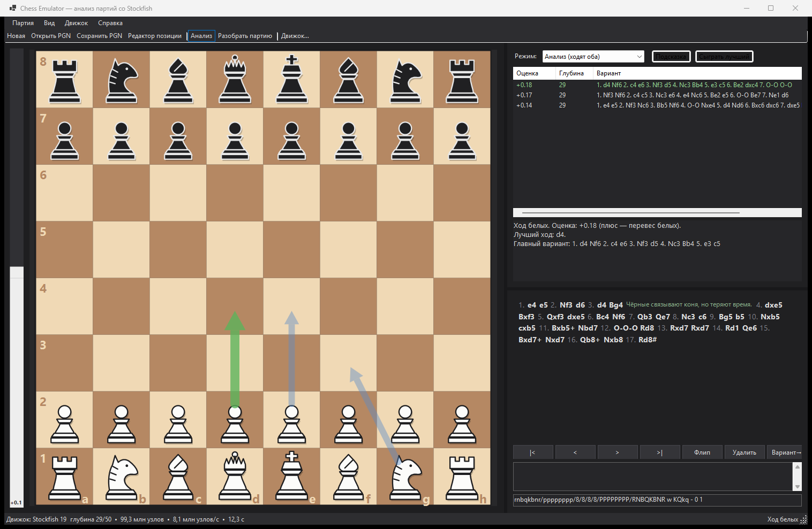

# Chess Emulator

Интерактивная шахматная доска на Windows Forms (.NET 10) для разбора партий и консультаций с движком Stockfish.



## Что умеет

**Доска и партия**
- Ходы мышью: перетаскиванием или «щёлкнул фигуру — щёлкнул клетку», с подсветкой возможных ходов.
- Полные правила: рокировки, взятие на проходе, превращение пешки, шах, мат, пат, недостаток материала, правило 50 ходов, троекратное повторение.
- Навигация по партии (← → Home End), переворот доски, подсветка последнего хода и шаха.
- Фигуры нарисованы векторной графикой прямо в программе: вид не зависит от шрифтов системы, силуэты читаются и на мелкой доске, высоты соотносятся правильно — пешка ниже ладьи, король выше всех.
- Дерево ходов с вариантами: ход, сделанный в середине партии, создаёт вариант; любой вариант можно поднять в основную линию.
- Комментарии к ходам, чтение и запись PGN (с вариантами, комментариями и знаками `?!`, `?`, `??`), работа с FEN через буфер обмена.

**Редактор позиции (Ctrl+E)**
- Свободная расстановка фигур мышью прямо на главной доске: выберите фигуру в палитре и щёлкайте по клеткам, правая кнопка убирает фигуру, фигуры можно перетаскивать.
- Очистка доски, возврат к начальной позиции, обмен позицией через FEN.
- Очередь хода, права на рокировку и поле взятия на проходе; невозможные права и поля снимаются автоматически.
- Проверка позиции: пока на доске нет по одному королю каждого цвета, есть пешка на крайней горизонтали или сторона не на ходу под шахом — применить позицию нельзя.
- «Применить» начинает партию с расставленной позиции (в PGN попадают теги `FEN` и `SetUp`), «Отмена» или Esc возвращают прежнюю партию.

**Движок**
- Постоянный анализ текущей позиции с несколькими вариантами (MultiPV), оценкой, глубиной и скоростью перебора.
- Шкала оценки слева и стрелки лучших ходов прямо на доске.
- Панель советов: лучший ход, главный вариант, и насколько сделанный ход уступает лучшему.
- Подсказка по запросу и режим игры против движка за любой цвет.
- «Разобрать партию» — прогон движка по всем позициям с расстановкой знаков `?!`, `?`, `??` и оценкой у каждого хода.
- Настройки движка: Threads, Hash, MultiPV, Skill Level, UCI_LimitStrength/UCI_Elo, лимиты по глубине и времени.

## Требования

- Windows 10/11
- [.NET 10 SDK](https://dotnet.microsoft.com/download) для сборки (для запуска достаточно .NET 10 Desktop Runtime)
- Stockfish — скачивается отдельно, см. ниже

## Сборка и запуск

```bash
dotnet run --project src/ChessEmulator
```

Открыть партию сразу при запуске:

```bash
dotnet run --project src/ChessEmulator -- samples/opera-game.pgn
```

## Подключение Stockfish

Движок не хранится в репозитории (папка `engine` в `.gitignore`) — скачайте его с [stockfishchess.org/download](https://stockfishchess.org/download) или со [страницы релизов на GitHub](https://github.com/official-stockfish/Stockfish/releases) и сделайте одно из двух:

1. Положите `stockfish.exe` в папку `engine` рядом с исполняемым файлом программы — он подхватится автоматически.
2. Или укажите путь вручную: меню **Движок → Настройки движка…**, кнопка **Обзор…**.

Программа также сама просматривает `%ProgramFiles%\Stockfish`, `%LOCALAPPDATA%\Programs\stockfish`, папку загрузок и каталоги из `PATH`. Подойдёт любой движок с интерфейсом UCI, не только Stockfish. Проверено со Stockfish 19 (сборка `stockfish-windows-x86-64-universal`).

Путь и настройки сохраняются в `%AppData%\ChessEmulator\settings.json`.

## Горячие клавиши

| Клавиши | Действие |
|---|---|
| ← / → | Ход назад / вперёд |
| Home / End | В начало / конец партии |
| Del | Удалить текущий ход с продолжением |
| F | Перевернуть доску |
| Ctrl+E | Редактор позиции (Esc — выйти без изменений) |
| Пробел | Включить/выключить анализ |
| Ctrl+N / Ctrl+O / Ctrl+S | Новая партия / открыть PGN / сохранить PGN |
| Ctrl+C / Ctrl+V | Копировать FEN / вставить FEN |

## Структура проекта

```
src/ChessEmulator/
  Chess/      правила игры: позиция и её строитель, генерация ходов, SAN, дерево партии, PGN
  Engine/     обёртка над UCI-движком, поиск исполняемого файла
  UI/         доска, шкала оценки, запись партии, главное окно, диалоги
  App/        настройки приложения
tests/ChessEmulator.CoreTests/    правила, нотация, дерево партии, PGN, строитель позиции
tests/ChessEmulator.EngineTests/  обёртка UCI, типы движка, настройки, поиск движка
tests/ChessEmulator.UiTests/      доска, редактор позиции, запись партии, шкала оценки, отрисовка фигур
tests/FakeUciEngine/              поддельный движок для тестов обёртки
tests/TestKit/                    общий движок проверок: разделы, счёт, итог
samples/                          пример партии в PGN
```

## Тесты

```bash
powershell -ExecutionPolicy Bypass -File tests/run-all.ps1
```

Скрипт прогоняет три набора подряд и возвращает ненулевой код, если хоть один провалился.
Наборы можно запускать и по отдельности:

```bash
dotnet run --project tests/ChessEmulator.CoreTests
```

Правила игры и запись партии: perft на 42 позициях (31 млн узлов, значения сверены с ответами
Stockfish на `go perft`) — от классических Kiwipete и «позиции 3» до тонких случаев: взятие на
проходе, оставляющее короля под шахом, рокировка с шахом, превращение уходом из-под шаха, пат
рядом с матом. Дальше: разбор и запись FEN, атаки и связки, применение хода со всеми следствиями
(рокировка, взятие на проходе, права, счётчик 50 ходов), неизменяемость позиции, недостаток
материала. Нотация SAN проверяется полным кругом: в 2 400 случайных позиций каждый из 71 тысячи
легальных ходов записывается и разбирается обратно — это ловит любую ошибку уточнения хода.
Отдельно: дерево партии с вариантами, определение результата, чтение и запись PGN
(варианты, комментарии, знаки `$1`–`$6` и `!?`, экранирование заголовков, несколько партий в файле)
и строитель позиции с автокоррекцией и проверкой.

```bash
dotnet run --project tests/ChessEmulator.EngineTests
```

Движок и настройки: рукопожатие `uci`/`isready`, разбор всех типов параметров (spin, check,
combo с пробелами, button, string без значения), строки `info` с MultiPV, матом, границами оценки
и счётчиками, `bestmove` с ходом для обдумывания и `(none)`, точный текст отправляемых команд,
остановка бесконечного анализа, отмена по токену, падение движка посреди поиска и запуск
несуществующего файла. Плюс форматирование оценок (точка как разделитель независимо от локали),
ограничения поиска, хранение настроек в JSON и поиск исполняемого файла движка.

```bash
dotnet run --project tests/ChessEmulator.UiTests
```

Интерфейс без показа окон: контролы рисуются в картинку, а мышь подаётся синтетически.
Доска — попадание по всем 64 клеткам (в том числе перевёрнутая), ходы щелчками и перетаскиванием,
превращение пешки с выбором и отказом, запрет взаимодействия, режим редактора и его события,
подсветка шаха и последнего хода, стрелки, координаты. Редактор позиции — палитра и ластик,
расстановка и перенос фигур, ввод FEN, очередь хода, права рокировки, поле взятия на проходе,
блокировка «Применить» при ошибках и нормализация позиции при применении. Плюс запись партии
(раскладка, варианты, оценки, выбор хода мышью), шкала оценки и отрисовка всех двенадцати фигур —
проверка, что фигура видна в клетке и не вылезает за её края.

Ключи для любого набора: `--verbose` печатает каждую проверку, `--full` добавляет глубокие
прогоны perft (на них уходит несколько секунд).

Не покрыто автотестами главное окно (`MainForm`): его поведение завязано на живой движок,
диалоги и буфер обмена — это проверяется вручную.
